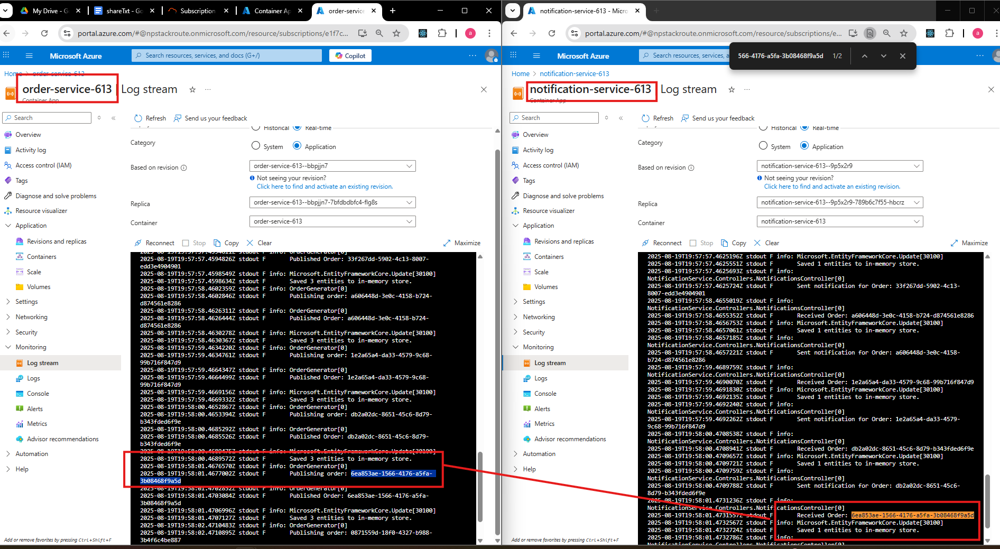

# E-Commerce Order Processing System with Dapr and .NET

This project demonstrates a complete, containerized microservices application using .NET 8 and Dapr to implement a pub/sub messaging pattern. It simulates a real-world e-commerce scenario where placing an order triggers multiple downstream services asynchronously.

## System Description

The overall system uses a producer, the **OrderService**, that generates orders and saves them to an in-memory database. Two consumers, the **NotificationService** and the **ShippingService**, receive messages from the OrderService, process the orders, and save records to their own in-memory databases.

## Architecture

### High-Level Architecture

The architecture consists of the three microservices communicating indirectly through a Dapr pub/sub message broker (Redis for local development). This decoupled design is resilient, scalable, and extensible.


### Message Traceability

End-to-end message traceability is achieved using Azure Application Insights, which provides a clear view of the message flow from the producer to the consumers.



## Local Development

### Running the Application

To run the application locally, you will need Docker Desktop and the .NET 8 SDK.

1.  **Clone the repository**.
2.  **Open a terminal** and navigate to the root directory of the project (`OrderProcessingService`).
3.  **Run the application** using Docker Compose:
    ```sh
    docker-compose up --build
    ```

The `docker screenshots` folder contains images that visually document the local development environment, including:

*   A screenshot of the running Docker containers.
*   Screenshots of Postman requests to the local endpoints for each service, showing how to test the application and the expected responses.

### Local Endpoints

While the application is running, you can use the following endpoints to view the data in each service's in-memory database:

*   **View all created orders**:
    *   `http://localhost:5001/orders`
*   **View all created shipments**:
    *   `http://localhost:5002/shipments`
*   **View all created notifications**:
    *   `http://localhost:5103/notifications`

### Docker Images and Environment

The `docker-compose.yml` file defines the services, networks, and volumes for the local environment. The key services are:

*   `orderservice`, `shippingservice`, `notificationservice`: The three .NET microservices.
*   `redis`: The Redis message broker.
*   `dapr-dashboard`: The Dapr dashboard.

Each service has its own Dockerfile that uses a multi-stage build to create an optimized and secure container image.

## Azure Deployment

### Deploying with the Script

The application can be deployed to Azure Container Apps using the provided `deployScript.sh` script.

1.  **Log in to Azure**:
    ```sh
    az login
    ```
2.  **Run the script**:
    ```sh
    ./deployScript.sh
    ```

The script will:
*   Build and push the Docker images to Azure Container Registry.
*   Provision all the necessary Azure resources, including Azure Container Apps, Redis, and Application Insights.
*   Deploy the services to the Azure Container Apps environment.

The `azure screenshots` folder contains images that visually document the Azure deployment, including:

*   A screenshot of the deployed container apps in the Azure portal.
*   Screenshots of Postman requests to the public endpoint of the deployed `OrderService`.

### Azure Endpoints

Once the deployment is complete, the script will output the URL for the `OrderService`, which is the only service with an external ingress. You can use this URL to view the created orders:

*   `https://order-service-<SUFFIX>.<REGION>.azurecontainerapps.io/orders`

The other services are only accessible from within the container app environment.

## AI-Driven Development

This project was developed with the assistance of an AI agent. The development process involved providing high-level requirements and then iteratively refining the code with the AI.

*   The `AI Tasks` folder contains the text output and screenshots of the AI's work.
*   The `ai_updates` git branch contains the code that was generated and updated by the AI.

## Logs and Data

The `docs` folder contains the following:

*   `Logs_query_data.csv`: A collection of logs from the application.