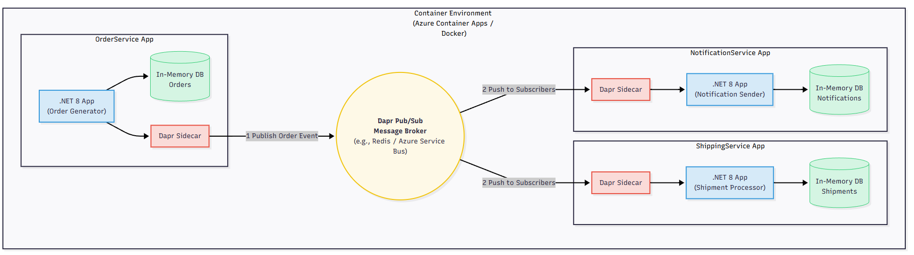
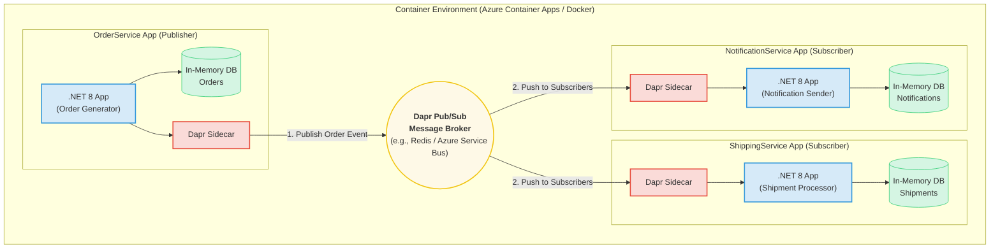

# Dapr Pub/Sub Example: E-Commerce Order Processing System

This project demonstrates a complete, containerized microservices application using .NET 8 and Dapr to implement a pub/sub messaging pattern. It simulates a real-world e-commerce scenario where placing an order triggers multiple downstream services asynchronously.

The system is designed to be run locally with Docker Compose and is structured for straightforward deployment to Azure Container Apps (ACA).

## Architecture

The architecture consists of three microservices communicating indirectly through a Dapr pub/sub message broker (Redis for local development). This decoupled design is resilient, scalable, and extensible.





### Dapr Pub/Sub Configuration

The communication between services is handled by Dapr's pub/sub building block. Here are the key configuration details:

*   **Pub/Sub Component Name**: The Dapr component for the message broker is named `pubsub`. This is defined in the `components/pubsub.yaml` file.
*   **Topic Name**: All order-related events are published to the `orders` topic. The `OrderService` publishes to this topic, and both the `ShippingService` and `NotificationService` are subscribed to it.

### Components

1.  **OrderService (Publisher)**:
    *   A .NET 8 Web API that simulates creating a new customer order every second.
    *   It publishes an `Order` event to the `orders` topic via its Dapr sidecar.
    *   It stores a copy of the created order in its own in-memory database.

2.  **ShippingService (Subscriber)**:
    *   A .NET 8 Web API that subscribes to the `orders` topic.
    *   When it receives an `Order` event, it creates a `Shipment` record and stores it in its in-memory database.

3.  **NotificationService (Subscriber)**:
    *   A .NET 8 Web API that also subscribes to the `orders` topic.
    *   When it receives an `Order` event, it creates a `Notification` record and stores it in its in-memory database, simulating sending a confirmation to the customer.

## Prerequisites

To run this project locally, you will need:
*   **Docker Desktop**: Make sure the Docker engine is running and configured to use Linux containers.
*   **.NET 8 SDK**: Required for building the container images.

## How to Run Locally

1.  **Clone the repository** or ensure all project files are in the correct directory structure.

2.  **Open a terminal** or command prompt and navigate to the root directory of the project (`OrderProcessingService`).

3.  **Run the application** using Docker Compose:
    ```sh
    docker-compose up --build
    ```
    This command will:
    *   Build the Docker image for each of the three microservices.
    *   Start containers for each service.
    *   Start a Dapr sidecar container for each service.
    *   Start a Redis container to act as the pub/sub message broker.

4.  **Observe the output** in your terminal. You will see interleaved logs from all services.
    *   `orderservice-1` will log "Published Order: ..." every second.
    *   `shippingservice-1` will log "Received Order: ..." and "Created Shipment: ...".
    *   `notificationservice-1` will log "Received Order: ..." and "Sent notification for Order: ...".

## Verifying the Services

While the application is running, you can access the following endpoints in your web browser or with a tool like Postman to see the data being stored in each service's in-memory database.

*   **View all created orders**:
    *   `http://localhost:5001/orders`

*   **View all created shipments**:
    *   `http://localhost:5002/shipments`

*   **View all created notifications**:
    *   `http://localhost:5103/notifications`

## Project Structure

```
/
├── components/
│   └── pubsub.yaml         # Dapr component for Redis pub/sub
├── OrderService/           # Publisher microservice
│   ├── Dockerfile
│   ├── OrderService.csproj
│   └── ...
├── ShippingService/        # Subscriber microservice
│   ├── Dockerfile
│   ├── ShippingService.csproj
│   └── ...
├── NotificationService/    # Subscriber microservice
│   ├── Dockerfile
│   ├── NotificationService.csproj
│   └── ...
├── .gitignore
├── OrderProcessingService.sln   # Visual Studio Solution
├── docker-compose.yml      # Local development and testing
└── README.md               # This file
```

## Next Steps: Deployment to Azure

This project serves as the foundation for the "INTROSPECT 1 B" hands-on lab. The next steps involve deploying this containerized application to the cloud:

1.  **Build and Push Images**: Build the Docker images for each service and push them to a container registry like Azure Container Registry (ACR).
2.  **Deploy to Azure Container Apps (ACA)**: Create an ACA environment and deploy the three services using the images from your ACR.
3.  **Configure Dapr**: Enable Dapr in your ACA environment and configure a Dapr component for a cloud-native message broker like **Azure Service Bus** instead of Redis.