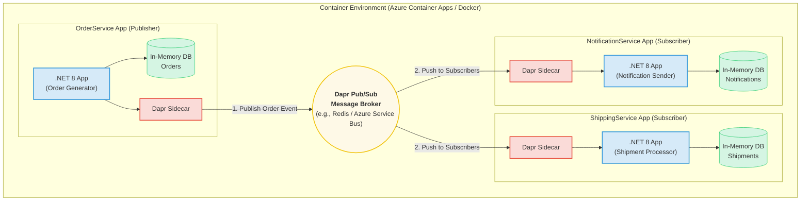

# Dapr Pub/Sub Example: E-Commerce Order Processing System

This project demonstrates a complete, containerized microservices application using .NET 8 and Dapr to implement a pub/sub messaging pattern. It simulates a real-world e-commerce scenario where placing an order triggers multiple downstream services asynchronously.

The system is designed to be run locally with Docker Compose and is structured for straightforward deployment to Azure Container Apps (ACA).

## Architecture

The architecture consists of three microservices communicating indirectly through a Dapr pub/sub message broker (Redis for local development). This decoupled design is resilient, scalable, and extensible.




### Dapr Pub/Sub Configuration

The communication between services is handled by Dapr's pub/sub building block. Here are the key configuration details:

*   **Pub/Sub Component Name**: The Dapr component for the message broker is named `pubsub`. This is defined in the `components/pubsub.yaml` file.
*   **Topic Name**: All order-related events are published to the `orders` topic. The `OrderService` publishes to this topic, and both the `ShippingService` and `NotificationService` are subscribed to it.

### Components

1.  **OrderService (Publisher)**:
    *   A .NET 8 Web API that simulates creating a new customer order every second.
    *   It publishes an `Order` event to the `orders` topic via its Dapr sidecar.
    *   It stores a copy of the created order in its own in-memory database.

2.  **ShippingService (Subscriber)**:
    *   A .NET 8 Web API that subscribes to the `orders` topic.
    *   When it receives an `Order` event, it creates a `Shipment` record and stores it in its in-memory database.

3.  **NotificationService (Subscriber)**:
    *   A .NET 8 Web API that also subscribes to the `orders` topic.
    *   When it receives an `Order` event, it creates a `Notification` record and stores it in its in-memory database, simulating sending a confirmation to the customer.

## Prerequisites

To run this project locally, you will need:
*   **Docker Desktop**: Make sure the Docker engine is running and configured to use Linux containers.
*   **.NET 8 SDK**: Required for building the container images.

## How to Run Locally

1.  **Clone the repository** or ensure all project files are in the correct directory structure.

2.  **Open a terminal** or command prompt and navigate to the root directory of the project (`OrderProcessingService`).

3.  **Run the application** using Docker Compose:
    ```sh
    docker-compose up --build
    ```
    This command will:
    *   Build the Docker image for each of the three microservices.
    *   Start containers for each service.
    *   Start a Dapr sidecar container for each service.
    *   Start a Redis container to act as the pub/sub message broker.

4.  **Observe the output** in your terminal. You will see interleaved logs from all services.
    *   `orderservice-1` will log "Published Order: ..." every second.
    *   `shippingservice-1` will log "Received Order: ..." and "Created Shipment: ...".
    *   `notificationservice-1` will log "Received Order: ..." and "Sent notification for Order: ...".

## Verifying the Services

While the application is running, you can access the following endpoints in your web browser or with a tool like Postman to see the data being stored in each service's in-memory database.

*   **View all created orders**:
    *   `http://localhost:5001/orders`

*   **View all created shipments**:
    *   `http://localhost:5002/shipments`

*   **View all created notifications**:
    *   `http://localhost:5103/notifications`

## Project Structure

```
/
├── components/
│   └── pubsub.yaml         # Dapr component for Redis pub/sub
├── OrderService/           # Publisher microservice
│   ├── Dockerfile
│   ├── OrderService.csproj
│   └── ...
├── ShippingService/        # Subscriber microservice
│   ├── Dockerfile
│   ├── ShippingService.csproj
│   └── ...
├── NotificationService/    # Subscriber microservice
│   ├── Dockerfile
│   ├── NotificationService.csproj
│   └── ...
├── .gitignore
├── OrderProcessingService.sln   # Visual Studio Solution
├── docker-compose.yml      # Local development and testing
└── README.md               # This file
```

## Telemetry and Monitoring

The application is instrumented with Azure Application Insights for end-to-end monitoring and distributed tracing.

### Features:

*   **Distributed Tracing**: Traces are correlated across services, providing a unified view of a request as it flows through the system.
*   **Custom Telemetry**: Custom events and metrics are tracked for key operations:
    *   **OrderService**: Tracks the publishing of orders, including latency and message size.
    *   **ShippingService & NotificationService**: Track the processing of incoming messages and the duration of the operation.
*   **Exception Tracking**: Unhandled exceptions are automatically captured and sent to Application Insights for analysis.
*   **Service Health**: Service startup and shutdown events are logged. Health check endpoints (`/healthz`) are available for each service.
*   **Dapr Telemetry**: Dapr is configured to send its telemetry to Application Insights, providing insights into the Dapr sidecars and components.

### Viewing Telemetry:

When deployed to Azure, you can view the telemetry in the Application Insights resource that is created by the deployment script. The "Application Map" feature provides a visual representation of the services and their dependencies, and you can drill down into individual requests to see the end-to-end trace.

## Resiliency and Retry Logic

The application uses Polly, a .NET resilience and transient-fault-handling library, to implement retry logic for key operations.

### Retry Policies:

*   **Dapr Pub/Sub Publishing**: The `OrderService` uses an exponential backoff retry policy when publishing messages to Dapr. This helps to handle transient network issues when communicating with the Dapr sidecar.
*   **Database Operations**: All services use a simple retry policy with increasing delays for database operations. This is to demonstrate the pattern, even though the in-memory database is unlikely to have transient faults.

These retry policies help to make the application more resilient to transient failures and improve the overall reliability of the system.

## Docker Compose Details

The `docker-compose.yml` file is configured to run the entire system locally. It defines the following services, all connected to a common `dapr-network`:

### Application Services

*   **`orderservice`**:
    *   **Image**: Built from `./OrderService/Dockerfile`.
    *   **Role**: The main application that publishes order events. It exposes an endpoint at `http://localhost:5001` to view created orders.
    *   **Dependencies**: Depends on `redis` to be healthy before starting.

*   **`shippingservice`**:
    *   **Image**: Built from `./ShippingService/Dockerfile`.
    *   **Role**: A subscriber that listens for order events and creates shipments. It exposes an endpoint at `http://localhost:5002` to view created shipments.
    *   **Dependencies**: Depends on `redis` to be healthy before starting.

*   **`notificationservice`**:
    *   **Image**: Built from `./NotificationService/Dockerfile`.
    *   **Role**: A subscriber that listens for order events and creates notifications. It exposes an endpoint at `http://localhost:5103` to view created notifications.
    *   **Dependencies**: Depends on `redis` to be healthy before starting.

### Dapr Components

*   **`orderservice-dapr`**, **`shippingservice-dapr`**, **`notificationservice-dapr`**:
    *   **Image**: `daprio/daprd:latest`.
    *   **Role**: These are the Dapr sidecars for each application service. They enable Dapr functionality, such as pub/sub, for their corresponding service. They are configured to use the `placement` service and load components from the `./components` directory.

*   **`placement`**:
    *   **Image**: `daprio/dapr`.
    *   **Role**: The Dapr placement service, which is required for actor placement and to ensure Dapr works correctly in a self-hosted environment.

*   **`dapr-dashboard`**:
    *   **Image**: `daprio/dashboard`.
    *   **Role**: A web-based UI for monitoring Dapr applications, accessible at `http://localhost:8080`.

### Infrastructure

*   **`redis`**:
    *   **Image**: `redis:alpine`.
    *   **Role**: The message broker used by the Dapr pub/sub component for local development. It exposes the Redis port `6379`.

### Dockerfiles

Each service (`OrderService`, `ShippingService`, `NotificationService`) has its own `Dockerfile` that follows a multi-stage build pattern to create an optimized and secure container image:

*   **`base` Stage**: Starts from the official .NET 8 ASP.NET runtime image. It sets up the working directory and exposes the necessary port.
*   **`build` Stage**: Uses the .NET 8 SDK image to build the application. It restores the NuGet packages, copies the source code, and builds the project in `Release` mode.
*   **`publish` Stage**: Publishes the application to create a self-contained set of files for deployment.
*   **`final` Stage**: Copies the published application from the `publish` stage into the `base` image. This results in a smaller final image that only contains the application and its runtime dependencies, without the SDK and build tools. The `ENTRYPOINT` is set to run the application's DLL.

This approach ensures that the final container image is as small as possible and has a reduced attack surface, as it does not contain the .NET SDK or the application's source code.

## Azure Deployment

This project can be deployed to Azure using the provided `deployScript.sh` script. This script automates the provisioning of Azure resources and the deployment of the application.

### Azure Resources Provisioned

The script creates the following resources in Azure:

*   **Azure Resource Group**:
    *   **Purpose**: Acts as a logical container for all the Azure resources created for this project.

*   **Azure Container Registry (ACR)**:
    *   **Purpose**: A private Docker container registry used to store and manage the container images for the `OrderService`, `ShippingService`, and `NotificationService`.

*   **Azure Log Analytics Workspace**:
    *   **Purpose**: Used to collect and analyze logs and metrics from the Azure Container Apps environment.

*   **Azure Application Insights**:
    *   **Purpose**: Used for application performance monitoring and distributed tracing. It is connected to the Log Analytics Workspace.

*   **Azure Container Apps Environment**:
    *   **Purpose**: A fully managed, serverless container service that provides the execution environment for the containerized applications. It is connected to the Log Analytics Workspace and Application Insights.

*   **Azure Container Apps**:
    *   **`order-service`**: The main application, configured with Dapr enabled and an external ingress to allow placing orders.
    *   **`shipping-service`**: A subscriber service, configured with Dapr enabled and an internal ingress.
    *   **`notification-service`**: A subscriber service, also configured with Dapr enabled and an internal ingress.
    *   **`redis`**: The Redis message broker, deployed as a container app with internal ingress.
    *   **`dapr-dashboard`**: The Dapr dashboard, deployed with an external ingress for monitoring.

*   **Dapr Pub/Sub Component**:
    *   **Purpose**: A Dapr component is configured at the environment level to use the deployed Redis container app as the pub/sub message broker.

### Deployment Script Details (`deployScript.sh`)

The `deployScript.sh` script is a comprehensive bash script that automates the entire deployment process to Azure. It is designed to be idempotent, meaning it can be run multiple times without causing errors.

**Key features of the script:**

*   **Variable-driven**: The script uses variables for resource names, locations, and other settings, making it easy to customize. It also generates a random suffix for resource names to ensure uniqueness.
*   **Error Handling**: The script uses `set -e` to exit immediately if any command fails, preventing partial deployments.
*   **Step-by-step Execution**: The script is divided into logical sections, each responsible for a specific part of the deployment process, with clear logging for each step.
*   **Dapr Configuration**: The script dynamically creates a YAML file for the Dapr pub/sub component, injecting the name of the deployed Redis container.
*   **Azure CLI Commands**: The script uses the Azure CLI (`az`) to interact with Azure, creating and configuring all the necessary resources.

**The script performs the following main actions:**

1.  **Build and Push Docker Images**: Builds the container images and pushes them to the newly created ACR.
2.  **Create Container App Environment**: Provisions the Container Apps environment and its dependencies (Log Analytics).
3.  **Deploy Redis**: Deploys the Redis container app.
4.  **Configure Dapr**: Creates and configures the Dapr pub/sub component.
5.  **Deploy Services**: Deploys the application services and the Dapr dashboard to the environment.

### How to Run the Deployment

1.  **Log in to Azure**:
    ```sh
    az login
    ```
2.  **Run the script**:
    ```sh
    ./deployScript.sh
    ```

The script will output the names of the created resources and the URLs for the externally accessible services.